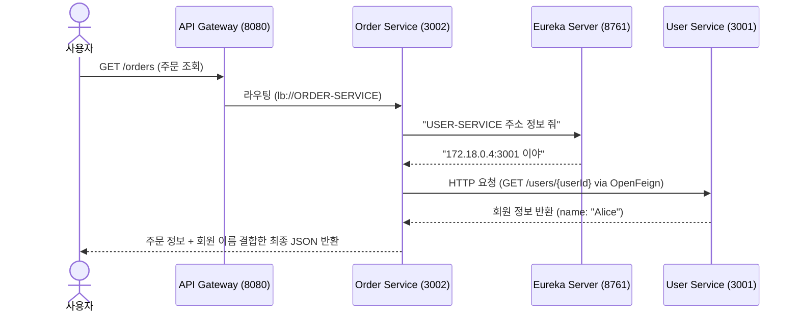
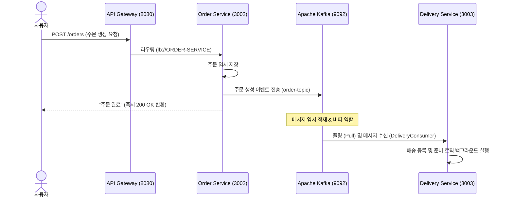

# 🌐 Spring Cloud MSA 인프라 및 통신 총정리

## **1. MSA 로컬 개발 워크플로우 (Docker와 IDE의 조화)**

### **❓ 개발 단계마다 매번 Docker 빌드를 해야 할까?**

- **결론**: **아니오!** 개발 중에는 분리하여 구동하는 것이 효율적입니다.
- **추천 실습 워크플로우**:
    1. **로컬 개발 & 디버깅**: DB, Redis, Message Queue(Kafka) 등 **인프라성 프로그램만 Docker**로 실행합니다. 실제 코드를 수정하는 Java 애플리케이션(`user-service`, `order-service`, `delivery-service`)은 **IDE(IntelliJ 등)에서 로컬 구동**하여 핫 스왑(Hot Swap) 및 디버깅을 빠르게 진행합니다.
    2. **통합 테스트 & 배포 검증**: 기능 개발 완료 후, **Docker Compose**를 이용해 전체 환경을 컨테이너화하여 연동 상태를 최종 검증합니다.

---

## **2. MSA 핵심 인프라 컴포넌트**

현재 구축한 MSA 인프라의 핵심 축인 **API Gateway**, `Service Discovery(Eureka)`, 그리고 **Config Server**의 역할 분담입니다.

| **컴포넌트** | **기술** | **역할** | **비유** |
| --- | --- | --- | --- |
| **Service Discovery** | **Netflix Eureka** | 마이크로서비스들의 이름, IP, 포트 정보를 동적으로 수집하고 생존 상태(Heartbeat)를 체크하는 서버 | **실시간 전화번호부** |
| **API Gateway** | **Spring Cloud Gateway** | 모든 클라이언트의 단일 진입점. 외부 포트를 단일화(`8080`)하고 내부 서비스를 숨기며 요청을 라우팅하는 서버 | **프론트 안내 비서 (Proxy)** |
| **Config Server** | **Spring Cloud Config** | 각 서비스의 설정 정보(`.yml`)를 외부 Git 저장소 등에서 중앙 관리하고 동적으로 제공하는 서버 | **중앙 설정 관리 본부** |
| **Message Broker** | **Apache Kafka** | 서비스 간의 비동기 메시지 송수신 및 트래픽 완충 역할을 담당하는 분산 이벤트 스트리밍 플랫폼 | **비동기 택배 터미널** |

### **🛠️ Eureka & Gateway 설정 코드 요약**

### **① Gateway의 `application.yml`**

- `lb://SERVICE-NAME` 형식을 통해 유레카에 등록된 서비스명으로 동적 라우팅 및 로드밸런싱을 수행합니다.

```yaml
server:
  port: 8080
spring:
  application:
    name: gateway-service
  cloud:
    gateway:
      routes:
        - id: user-service
          uri: lb://USER-SERVICE  # Eureka에 등록된 이름 기반 라우팅
          predicates:
            - Path=/users/**
        - id: order-service
          uri: lb://ORDER-SERVICE
          predicates:
            - Path=/orders/**
```

---

## **3. OpenFeign을 활용한 서비스 간 통신 (Inter-service Call)**

마이크로서비스끼리 데이터를 주고받기 위해 동기식 HTTP 통신을 편리하게 만들어주는 **Spring Cloud OpenFeign** 기술을 적용했습니다.

### **🔄 아키텍처 흐름도 (주문 조회 시 회원 이름 결합하기)**



### **💻 핵심 소스 코드**

### **① Feign Client 인터페이스 정의 (`order-service`)**

- 선언적으로 어노테이션만 달아두면 Spring이 알아서 HTTP 요청 구현체를 만들어줍니다.

```java
// @FeignClient: Eureka에 등록된 서비스 이름(name)을 가지고 호출을 매핑합니다.
@FeignClient(name="user-service", fallback=UserClientFallback.class) // Eureka 등록 서비스명 및 fallback 매핑
public interface UserClient {
    // user-service의 특정 API Endpoint와 HTTP Method를 매핑합니다.
    @GetMapping("/users/{userId}") // 상대방 서비스의 API 스펙 정의
    Map<String, Object> getUserById(@PathVariable("userId") Long userId);
}
```

### **② 컨트롤러에서 Feign Client 사용 (`order-service`)**

```java
@RestController
public class OrderController {
    private final UserClient userClient;

    public OrderController(UserClient userClient) {
        this.userClient = userClient;
    }

    @GetMapping("/orders")
    public Map<String, Object> getOrders() {
        // ... 생략 ...
        // Feign Client를 통해 동적으로 회원 이름을 조회하여 응답 데이터를 강화(Enrich)
        Map<String, Object> user = userClient.getUserById(userId);
        enriched.put("userName", user.get("name"));
        // ... 생략 ...
    }
}
```

---

## **4. 모놀리스 패키지 호출 vs MSA Feign 호출 비교**

비록 자바 코드 레벨에서는 똑같은 메서드 호출로 보이지만, 아래와 같은 명확한 차이점이 있습니다. **이 차이를 인지하고 장애 대책을 세우는 것이 MSA 개발자의 역량**입니다.

1. **메모리 vs 네트워크**:
    - 일반 패키지 호출은 같은 메모리(JVM) 공간 안에서의 호출이므로 실패할 일이 없고 나노초 단위로 빠릅니다.
    - Feign 호출은 **물리적 서버 간 네트워크 I/O(HTTP)**이므로 네트워크 상태에 따른 지연과 통신 에러가 항상 존재합니다.
2. **장애 전파 (Cascading Failure)**:
    - 호출 대상 서버(`user-service`)가 먹통이 되면 호출한 서버(`order-service`)도 응답을 대기하느라 스레드가 차서 함께 죽을 수 있습니다.
    - **대비책**: **서킷 브레이커(Circuit Breaker)** 기술을 추가해 장애 발생 시 즉시 차단막을 내리고 Fallback 데이터를 내려주어야 합니다. (아래 5장 참고)
3. **분산 트랜잭션의 부재**:
    - 네트워크로 서버가 찢어져 있으므로 단일 `@Transactional` 어노테이션이 통하지 않습니다. 데이터 불일치를 제어할 설계(Saga 패턴, Outbox 패턴 등)가 필요합니다.

---

## **5. Resilience4j를 활용한 서킷 브레이커 (Circuit Breaker & Fallback)**

마이크로서비스 호출 시 상대방 서버 장애로 인한 나의 연쇄 다운(장애 전파)을 방지하기 위한 **장애 복구력(Fault Tolerance)** 기술입니다.

### **🛠️ 설정 및 구성 요소**

### **① 호출 주체 (`order-service`)의 의존성 및 YML 설정**

- **`build.gradle` 의존성 추가**

```groovy
implementation 'org.springframework.cloud:spring-cloud-starter-circuitbreaker-resilience4j'
```

- **`application.yml` Feign 서킷 브레이커 활성화**

```yaml
spring:
  cloud:
    openfeign:
      circuitbreaker:
        enabled: true # Feign이 서킷 브레이커를 내장하도록 활성화
```

### **② Fallback(대체 수단) 구현 및 매핑**

- **`UserClientFallback` 구현체 클래스 작성**

```java
// @Component를 이용해 Spring Bean으로 등록해둡니다.
@Component
public class UserClientFallback implements UserClient {
    @Override
    public Map<String, Object> getUserById(Long userId) {
        // user-service 장애 발생 시 돌려줄 대체 임시 데이터 정의
        return Map.of(
            "id", userId,
            "name", "🚨 서비스 일시 불가 (Temporarily Unavailable User)"
        );
    }
}
```

### **🔄 장애 극복 시뮬레이션 동작 검증**

1. **정상 구동 상태**:
    - `GET http://localhost:8080/orders` 요청 시 `user-service`로부터 정상 회원 이름을 가져와 결합합니다. (예: `Alice`, `Bob`)
2. **장애 발생 상태 (`user-service` 종료)**:
    - `docker compose stop user-service` 실행 후 주문 조회를 하면, 전체 API 에러가 나지 않고 다음과 같이 Fallback에 등록된 대체 이름으로 정상 조회됩니다.
    - `userName`: `"🚨 서비스 일시 불가 (Temporarily Unavailable User)"`
3. **자가 치유 상태 (`user-service` 재기동)**:
    - `docker compose start user-service` 실행 후 서버가 복구되면 다시 유레카에서 최신 주소를 갱신하여 원본 회원 이름으로 자동 복구됩니다.

---

## **6. Apache Kafka를 활용한 비동기 이벤트 기반 통신 (Asynchronous Event-Driven Call)**

주문 처리 프로세스 중 배송 등 즉각적인 동기식 응답이 필요하지 않은 작업을 별도의 서비스로 분리하고, **Apache Kafka 메시지 브로커**를 도입하여 결합도를 낮추고 시스템 안정성을 올렸습니다.

### **🔄 아키텍처 흐름도 (주문 생성 시 비동기 배송 처리)**



### **💻 핵심 소스 코드**

### **① Kafka Producer 설정 및 이벤트 발행 (`order-service`)**
- [OrderProducer.java](file:///c:/Users/KOSA/Desktop/msa-step1/order-service/src/main/java/com/example/order/OrderProducer.java)

```java
@Service
public class OrderProducer {
    private static final String TOPIC = "order-topic";
    private final KafkaTemplate<String, Object> kafkaTemplate;

    public OrderProducer(KafkaTemplate<String, Object> kafkaTemplate) {
        this.kafkaTemplate = kafkaTemplate;
    }

    public void sendOrderEvent(Map<String, Object> orderData) {
        System.out.println("Kafka Producer: Sending order event -> " + orderData);
        kafkaTemplate.send(TOPIC, orderData); // 비동기로 토픽에 발행
    }
}
```

### **② Kafka Consumer 설정 및 이벤트 구독 (`delivery-service`)**
- [DeliveryConsumer.java](file:///c:/Users/KOSA/Desktop/msa-step1/delivery-service/src/main/java/com/example/delivery/DeliveryConsumer.java)

```java
@Service
public class DeliveryConsumer {
    @KafkaListener(topics = "order-topic", groupId = "delivery-group")
    public void consumeOrderEvent(Map<String, Object> orderData) {
        System.out.println("=========================================");
        System.out.println("🚚 [배송 서비스] Kafka 메시지 수신 완료!");
        System.out.println("📦 주문 내역 정보: " + orderData);
        System.out.println("👉 배송 준비를 시작합니다 (주문 ID: " + orderData.get("orderId") + ")");
        System.out.println("=========================================");
    }
}
```

### **🛡️ 이벤트 기반 비동기 통신의 핵심 특징**

1. **비동기 처리를 통한 빠른 응답 (Non-blocking Response)**:
   - 주문 생성 요청 시 사용자는 배송 완료 여부나 긴 작업 대기 없이 즉시 "주문 접수" 성공 응답을 받아 사용자 대기 시간을 대폭 줄입니다.
2. **트래픽 제어 및 백프레셔 (Backpressure Control / Traffic Shaving)**:
   - 카프카는 **Pull(가져오기) 방식**으로 동작하므로, 트래픽 폭증 상황에서 브로커에 메시지가 대량으로 쌓이더라도 컨슈머(`delivery-service`)가 자신이 감당할 수 있는 속도로만 카프카에서 메시지를 읽어옵니다.
   - 배송 서비스 서버가 급격한 부하로 인해 다운(Crash)되는 현상을 원천 방지하여 서버의 안정성을 대폭 개선합니다.

---

## **7. 사용자 요청 처리 전체 흐름 (호출 시나리오)**

사용자가 API Gateway를 거쳐 주문을 생성하거나 조회할 때 전체적인 서비스 간 통신 흐름도입니다.

```text
[사용자]
   │
   ▼ ① GET /orders 또는 POST /orders 요청 (사용자는 8080 게이트웨이 주소만 앎)
[API Gateway (8080)]
   │
   ├─► ② 유레카(8761)에 문의: "ORDER-SERVICE의 실제 포트가 뭐야?"
   │   ◀── 유레카의 대답: "3002번 포트야"
   │
   ▼ ③ 게이트웨이가 직접 3002번 포트로 요청 포워딩
[Order Service (3002)]
   │
   ├─► [GET /orders 호출 시] OpenFeign 통신 (동기)
   │   ├─► 유레카에 문의: "USER-SERVICE의 실제 포트가 뭐야?"
   │   ◀── 유레카의 대답: "3001번 포트야"
   │   ▼
   │   ├─► [정상] 3001번으로 직접 통신하여 회원 이름("Alice") 가져옴
   │   └─► [장애] 3001번이 죽었을 시 서킷 브레이커 작동 ➡️ Fallback 데이터("🚨서비스 불가") 가져옴
   │
   ├─► [POST /orders 호출 시] Apache Kafka 발행 (비동기)
   │   ├─► 카프카 브로커("order-topic")로 주문 생성 이벤트 전송
   │   └─► 사용자에게 "주문 완료" 즉시 응답 (Non-blocking)
   │
   ▼ ④ [비동기 흐름] 카프카 토픽에 적재 및 버퍼링
[Apache Kafka (order-topic)]
   │
   ▼ ⑤ 폴링(Pull)하여 메시지 수신 및 배송 로직 비동기 실행
[Delivery Service (3003)]
```

---

## **8. 마이크로서비스 기동 순서 가이드 (Service Startup Order Guide)**

로컬 환경에서 전체 MSA 애플리케이션을 기동할 때, 서비스 간 의존성(설정 가져오기, 유레카 등록 등) 때문에 구동 순서가 매우 중요합니다. 아래 순서대로 기동하는 것을 권장합니다.

1. **인프라 서비스 구동 (Docker)**
   - Kafka, MariaDB, Zookeeper 등 공통 인프라를 먼저 실행합니다.
   - 예: `docker-compose up -d zookeeper kafka` 혹은 로컬 데이터베이스 서비스를 구동합니다.
2. **`config-service` (포트 `8888`) 기동**
   - 각 마이크로서비스가 실행되면서 중앙 설정 정보를 먼저 읽어야 하므로, 가장 먼저 구동을 완료해야 합니다.
3. **`discovery-service` (포트 `8761`) 기동**
   - 유레카 서버가 실행되어 활성화 상태여야 다른 서비스들이 기동될 때 자신의 네트워크 주소를 등록(Registration)할 수 있습니다.
4. **개별 마이크로서비스 및 API Gateway 기동**
   - 아래 순서로 마이크로서비스를 실행합니다.
     - `user-service` (3001)
     - `order-service` (3002)
     - `delivery-service` (3003)
     - `api-gateway` (8080)

---

## **9. 데이터베이스 구성 및 트러블슈팅 (Database Configuration & Troubleshooting)**

각 마이크로서비스는 **Database-per-Service** 패턴을 준수하여 각각 독립된 데이터베이스 스키마를 사용합니다.

| **마이크로서비스** | **연동 데이터베이스** | **기본 포트** |
| --- | --- | --- |
| **user-service** | `user_db` | `3306` |
| **order-service** | `order_db` | `3306` |
| **delivery-service** | `delivery_db` | `3306` |

### **🚨 트러블슈팅: 한글 데이터 입력 시 `Incorrect string value` 에러**

주문 시 한글 상품명("지포" 등)을 저장하거나 한글 사용자 정보를 가입시킬 때 아래와 같은 예외가 발생할 수 있습니다.

> `java.sql.SQLSyntaxErrorException: (conn=18) Incorrect string value: '\xEC\xA7\x80...' for column 'item' at row 1`

#### **💡 원인**
Spring Boot의 `createDatabaseIfNotExist=true` 옵션에 의해 처음 데이터베이스가 자동 생성될 때, 로컬 MariaDB/MySQL 서버의 기본 캐릭터 셋(예: `latin1`)으로 생성되어 다국어(UTF-8) 문자를 표현하지 못해 생기는 문제입니다.

#### **🛠️ 해결 방법 (SQL 명령 실행)**
데이터베이스 관리 툴(HeidiSQL, DBeaver 등)이나 MariaDB CLI로 접속하여 각 데이터베이스와 테이블의 캐릭터 셋을 `utf8mb4`로 명시적 변경합니다.

```sql
-- 1. 각 데이터베이스의 기본 캐릭터 셋을 utf8mb4로 변경
ALTER DATABASE order_db CHARACTER SET utf8mb4 COLLATE utf8mb4_unicode_ci;
ALTER DATABASE user_db CHARACTER SET utf8mb4 COLLATE utf8mb4_unicode_ci;
ALTER DATABASE delivery_db CHARACTER SET utf8mb4 COLLATE utf8mb4_unicode_ci;

-- 2. 이미 생성된 테이블(예: orders)의 문자셋 일괄 변환
ALTER TABLE order_db.orders CONVERT TO CHARACTER SET utf8mb4 COLLATE utf8mb4_unicode_ci;
```

#### **🔗 JDBC URL 문자 인코딩 설정 추가**
추가적으로 `config-repo` 내의 설정 파일들에서 JDBC 연결 문자열 뒤에 한글 인코딩 설정을 보강하면 더 안전하게 연동할 수 있습니다.
* 예시: `&useUnicode=true&characterEncoding=utf-8` 추가
```yaml
url: jdbc:mariadb://localhost:3306/order_db?createDatabaseIfNotExist=true&useUnicode=true&characterEncoding=utf-8
```
